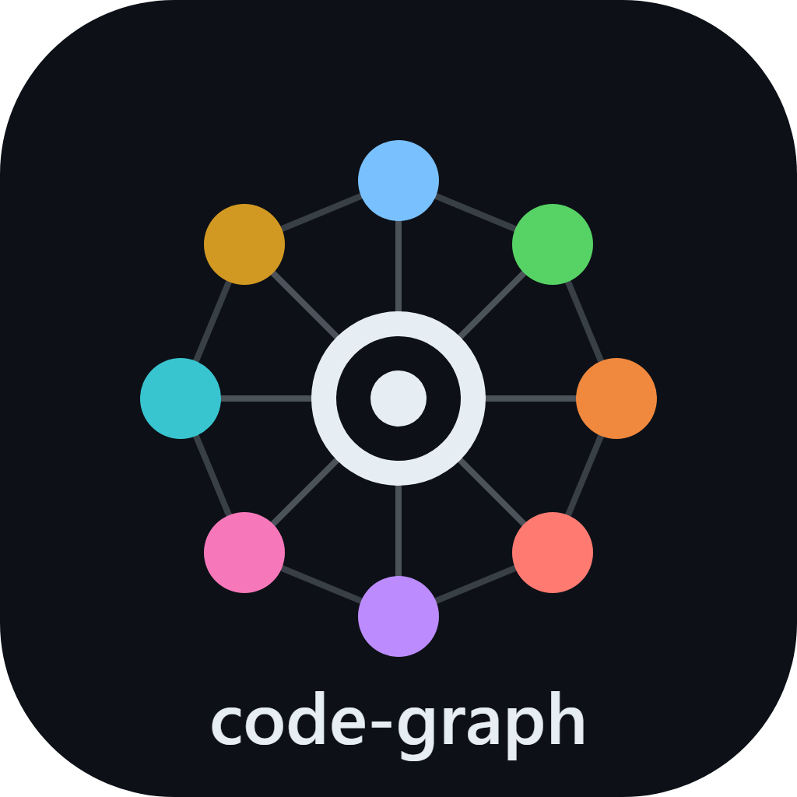
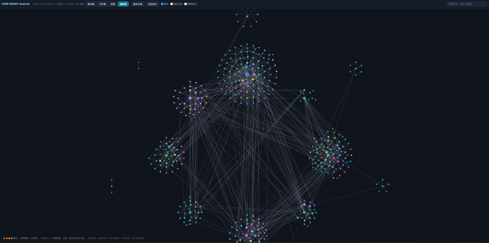
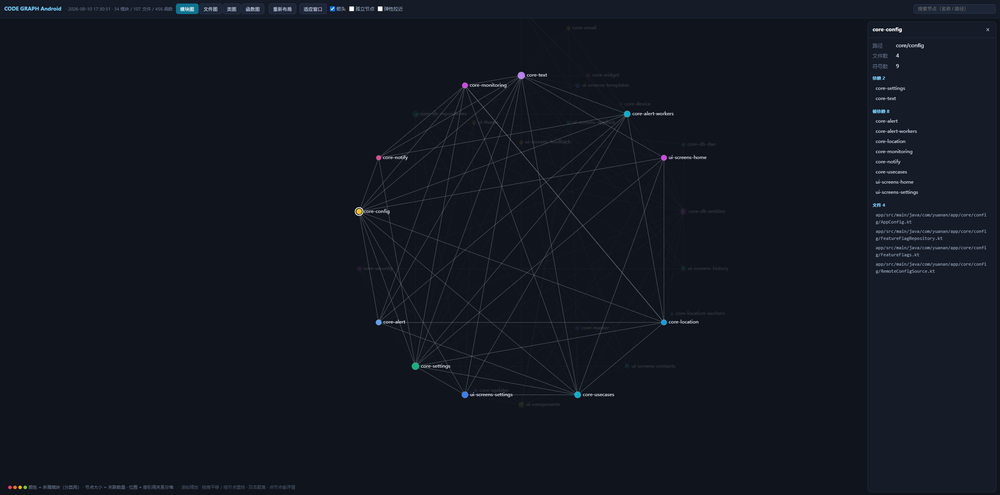
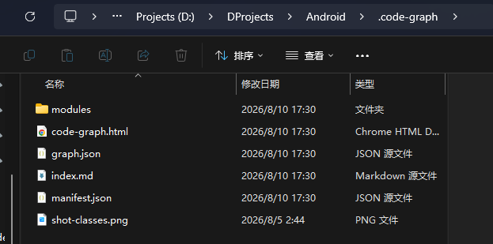

<p align="center">
  
</p>

<h1 align="center">code-graph</h1>

<p align="center">
  Builds a three-level call graph (module → file → function) of your project
  and lets Claude query small subgraphs by keyword instead of reading source code.
  <br>
  <b>Everything runs locally</b>: scanning, parsing, querying and visualization never touch the network,
  code never leaves your machine, zero third-party dependencies.
</p>

<p align="center">
  English · <a href="README.md">中文</a>
</p>

---

## What it is

The usual way to help Claude understand an unfamiliar project is to stuff the source code into context —
which blows the token budget on large projects. code-graph does the opposite:

1. Parse the project into a graph (module dependencies, file relations, function calls);
2. Store it in `.code-graph/` at the project path (the directory passed to `--root`);
3. Claude reads the graph first, queries small subgraphs by keyword, and only reads source files
   when the graph isn't enough.

The graph comes with a self-contained `code-graph.html` — double-click it to browse the module,
file and function dependency structure in any browser, no server or tooling needed.

Querying a graph instead of reading source saves tokens, and cross-file dependencies become explicit.

Parsing and querying all run on your own machine (just Python 3.8+).
**Your code never leaves your computer.**

## Features

- **Three levels**: modules (import-level dependencies) → files → functions/classes with call relations
- **Hash-based incremental updates**: content hashes (sha256) detect changes, only changed files are re-parsed; changes pulled via `git pull` are picked up too
- **Keyword search**: returns a small subgraph — matching symbols with signature, file, line, callers/callees, and module slice path
- **Self-contained visualization**: `code-graph.html` inlines all data, styles and scripts — double-click to open (`file://`), no server needed
- **Four views**: module / file / class / function graphs; nodes colored by module, laid out in clusters by reference relations
- **Multi-language**: parses classes and functions in Kotlin / Java / Python / TypeScript (incl. JS) / Go; other languages fall back to file-level structure

## Screenshots

Function graph view (click a node for signature, doc comments, file:line, callers/callees):



Module graph view (import-level dependencies, nodes colored by module, grouped by reference relations):



Generated `.code-graph/` directory (hash manifest + graph data + module slices + visualization page):



## Installation

Requires [Claude Code](https://docs.anthropic.com/en/docs/claude-code/setup). Put the `SKILL.md` and `scripts/` from this repo into Claude's global skills directory:

```bash
# macOS / Linux
git clone https://github.com/<your-name>/code-graph-skill.git
mkdir -p ~/.claude/skills
cp -r code-graph-skill ~/.claude/skills/code-graph
```

```powershell
# Windows (PowerShell)
git clone https://github.com/<your-name>/code-graph-skill.git
Copy-Item -Recurse code-graph-skill "$env:USERPROFILE\.claude\skills\code-graph"
```

Once installed it's a **global skill**: available to every project automatically, no per-project setup.
The only requirement is Python 3.8+, no third-party packages.

## Usage

No manual steps for daily use: Claude Code invokes the skill automatically at session start and
when it gets a code task (update the graph first, then query by keyword, read source only when
the graph isn't enough).

You can also type `/code-graph` in the input box to invoke it manually (it shows up in the
slash-command menu once deployed globally) — this runs the update protocol and refreshes the graph.

You can also run the scripts directly:

```bash
# Update the graph (incremental). Use python on Windows, python3 elsewhere
python ~/.claude/skills/code-graph/scripts/update.py --root <project-path>
# Windows: python %USERPROFILE%\.claude\skills\code-graph\scripts\update.py --root <project-path>

# Search by keyword
python ~/.claude/skills/code-graph/scripts/query.py --root <project-path> <keyword>

# Search by file / machine-readable output
python ~/.claude/skills/code-graph/scripts/query.py --root <project-path> --file src/main.kt
python ~/.claude/skills/code-graph/scripts/query.py --root <project-path> <keyword> --json
```

Every `update.py` run regenerates `.code-graph/code-graph.html` — double-click to explore:

- Toolbar switches between module / file / class / function views
- Click a node: the side panel shows details (signature, doc comments, file:line, callers/callees — clickable)
- Drag nodes to rearrange, scroll to zoom, double-click to focus, search box jumps across views
- Stays interactive even with thousands of nodes (Canvas rendering + force simulation)

> To only re-render the HTML without rescanning source code:
> `python ...\scripts\render_html.py --root <project-path>`

## How it works

```
source scan ──► lexical static parsing (classes / functions / call relations) ──► sha256 vs manifest (incremental)
                                                                                        │
                                                                                        ▼
                                                                     writes to .code-graph/
                                                                     ├── manifest.json      content hashes
                                                                     ├── graph.json         graph data (modules/symbols/edges)
                                                                     ├── index.md           global index (locate modules)
                                                                     ├── modules/<id>.md    module slices (signatures + calls + AI summaries)
                                                                     └── code-graph.html    self-contained visualization
```

When Claude needs to understand the project, it reads `index.md` first, then runs `query.py` with
task keywords to get small subgraphs, and only opens source files by `file:` location when the graph
isn't enough. Semantic summaries (module responsibilities) are written by the AI into `modules/<id>.md`
and can be maintained by hand.

## Limitations

- Call relations are **lexical static matching**: polymorphism, reflection, dynamic imports and cross-process calls are not detected; same-name overloads are disambiguated best-effort, falling back to "same-file first, otherwise connect all" — the graph is marked as approximate
- Interfaces / abstract methods (no body) produce no call edges (e.g. Room DAOs, Android framework callbacks live outside the graph — expected)
- Module-level import dependencies are parsed for package-based languages (Kotlin/Java) only; other languages get nodes without edges
- The graph is a snapshot: AI-written semantic summaries may drift from code; structure is refreshed by `update.py` on rebuild

See `SKILL.md` for details.

## FAQ

**Should `.code-graph/` be committed to version control?**
It's generated output — usually no. Add it to `.gitignore`.

**I changed the code, the graph is stale?**
The next `update.py` run detects changes by hash and updates incrementally (triggered automatically in Claude Code sessions); you can also run it manually right after a bigger change.

**My project isn't written in Python — will it still work?**
Yes. Kotlin / Java / Python / TypeScript (incl. JS) / Go get full class/function/call-chain parsing; other languages (C/C++/Rust/Swift etc.) fall back to file-level structure (no symbols, no call edges) — the graph is still generated.

**What environment does it need?**
Just Python 3.8+ (standard library only, no third-party packages).

## License

[Apache-2.0](LICENSE)
